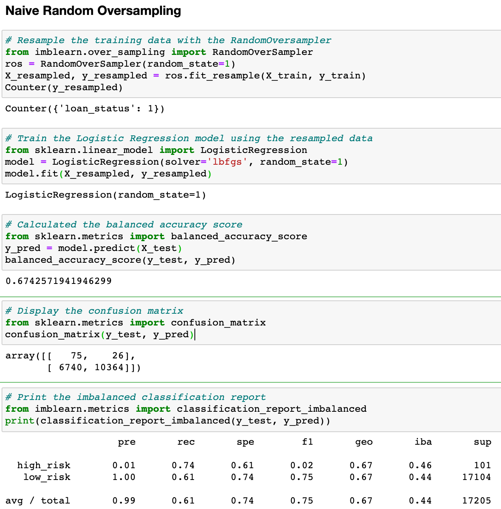
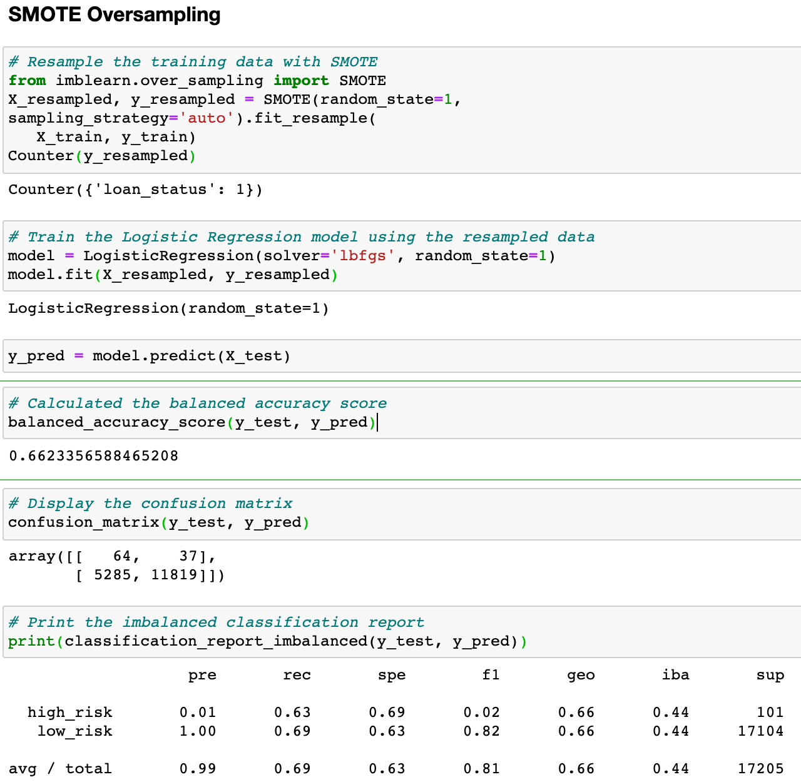
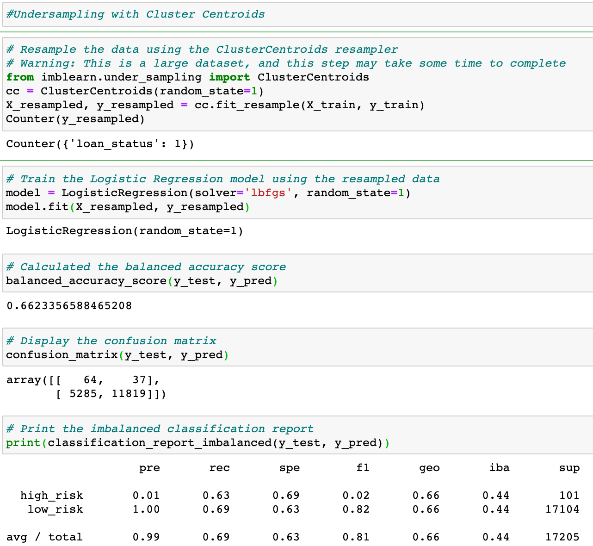
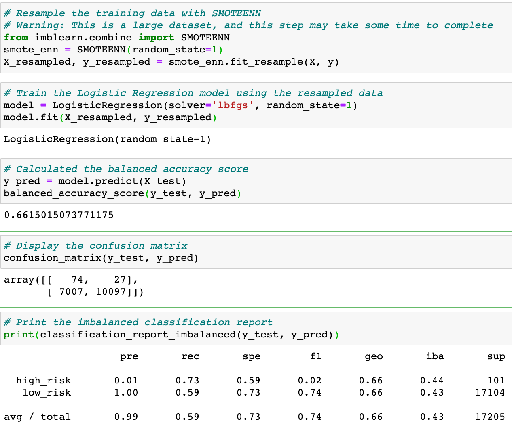
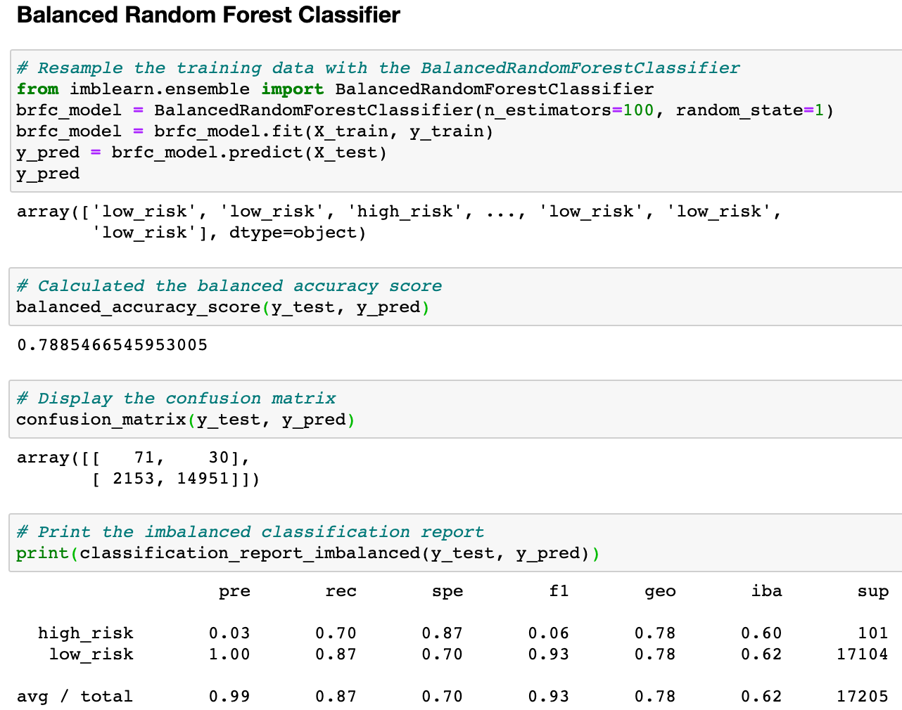
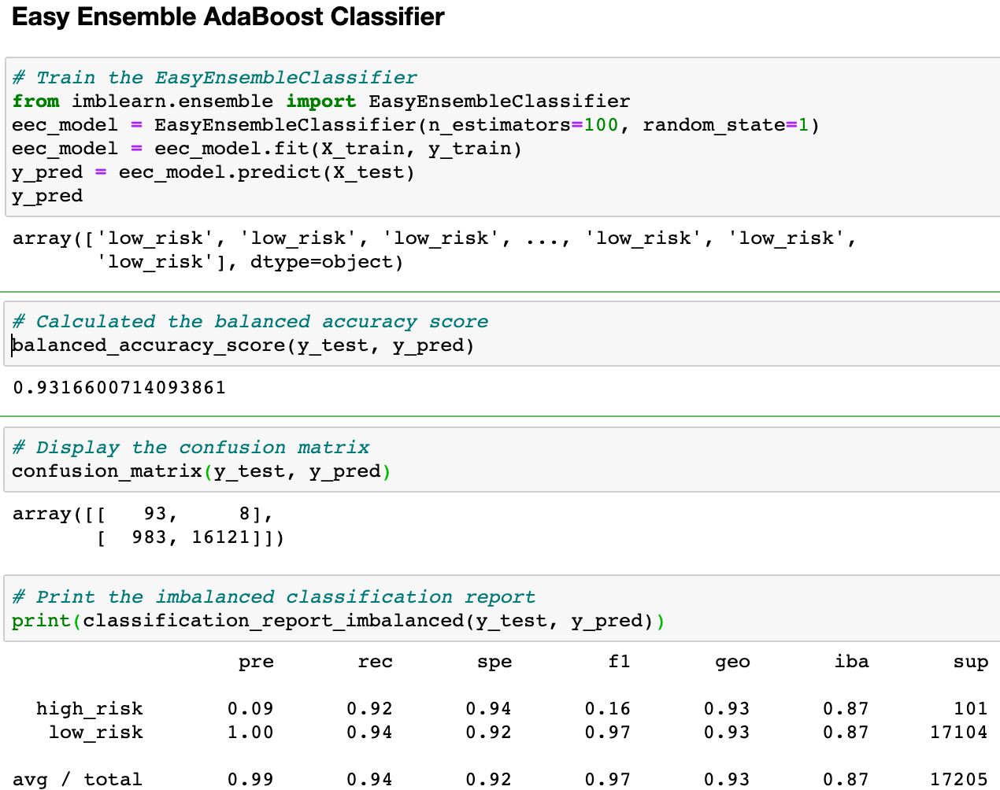

# Credit Risk Analysis

## Overview of the analysis: 
The objective of this analysis is to determine which machine learning models best represent credit risk for LendingClub loan applicants. Since the provided data contains a significant imbalance between the quantities of good (low-risk) loans and bad (high-risk) loans, we ran several algorithms to resample the data and balance out the high-risk loan data so that machine learning models do not contain bias towards the larger (majority) low-risk loan data. The models we ran  oversample and under sample the dataset, as well employing a combinatorial model that both over -and- under samples data and finally we used two models that reduce bias in sample data, in an effort to find an optimal model.

## Resources
* Python 3
* Jupyter Notebook
* VS Code
* Machine Leaning libraries:
    * imblearn
    * scikit learn

## Results
The results of our evaluation of the models follows...

* The Naive Random Oversampling method increases the size of the minority class (high risk loans) by randomly selecting and adding instances from this same dataset. Accuracy and recall scores for this model are above 0.6 however, the precision and F1 scores for the high risk class are both very low (0.01 and 0.02, respectively)
    

 
Random Oversampling 
 * balanced accuracy score: 0.67 
    * precision scores 
        * high risk 0.01
        * low risk 1
    * recall scores
        * high risk 0.74
        * low risk 0.61
    * F1 Score
        * high risk 0.02

* The SMOTE algorithm oversamples the high risk loan (minority) class by creating new instances that are interpolated from the neearest neighbors of an existing instance, instead of being randomly selected. Running this model on the LendingClub data produces a slightly lower accuracy rate and similarly very low high risk precision and F1 scores.

 
* SMOTE Algorithm overSample
    
    * balanced accuracy score: 0.66 
    * precision  
        * high risk 0.01
        * low risk 1

    * recall scores
        * high risk 0.63
        * low risk 0.69
    * F1 Score
        * high risk 0.02

* The Cluster Centroids method undersamples the majority class, in our case low risk loans, to rebalance the proportion of low risk to high risk loans in our testing dataset. In this iteration, this model has almost exactly the same accuracy and precision as well as recall for high risk loans.
 
 
* ClusterCentroids undersample
    * balanced accuracy score: 0.67
    * precision  
        * high risk 0.01
        * low risk 1

    * recall scores
        * high risk 0.63
        * low risk 0.69
    * F1 Score
        * high risk 0.02

* The SMOTEENN algorithm combines oversampling with undersampling to rebalance the loan classes. Our rebalanced training dataset produces a marginally lower accuracy rate and similar precision, recall and F1 scores to our previous results, and again very low high risk precision and F1 scores.

 
* SMOTEENN algorithm
    * balanced accuracy scores 
    * precision  
        * high risk
        * low risk

    * recall scores
        * high risk
        * low risk
    * F1 Score
        * high risk 0.02

* The Balanced Random Forest Classifier is another machine learning model that reduce bias by undersampling each bootstrap sample to balance the minority class. For our dataset this model shows an improvement in the balanced accuracy score (0.78), compared to the previous models, however precision and F1 scores for the high risk loan class, while higher than before, are still low (0.03 and 0.06 respectively).

* Balanced Random Forest Classifier 
    * balanced accuracy score: 0.78
    * precision  
        * high risk 0.03
        * low risk 1.00

    * recall scores
        * high risk 0.70
        * low risk 0.87
    * F1 Score
        * high risk 0.06

* The Easy Ensemble Classifier is a model that uses a group or ensemble of algorithms that are trained on different balanced bootstrap samples by random undersampling.  This model produces the highest balanced accuracy score of any of the models we have used so far (0.93). This model also produces the highest precision and F1 scores for the high risk loan minority class, but these scores still remain relatively low (0.09 and 0.16).

 
* EasyEnsembleClassifier
    * balanced accuracy score: 0.93
    * precision  
        * high risk 0.09
        * low risk 1.00

    * recall scores
        * high risk 0.92
        * low risk 0.94
    * F1 Score
        * high risk 0.16

## Summary: 
Our analysis shows that it is possible to improve the accuracy, precision and recall (sensitivity) of machine learning models that attempt to predict outcomes when using very imbalanced datasets.  Our Naive Random Oversampling, SMOTE, Cluster Centroids and SMOTEENN models produce roughly similar evaluation metrics.  We see a marked improvement in balanced accuracy and precion and F1 scores for the high risk loan class with the Balanced Ramdom Forest Classifier, and even higher scores for the Easy Ensemble Classifier model, however this may not demonstrate enough robustness to rely solely on this model for future loan application decisions. the marginally better Easy Ensemble Classifier results still have very low precision scores for high risk loans (0.09) and F1 scores (0.16) which indicate this model is likely to predict only 9% of the high risk loans appropriately. We would recommend continued work on this topic, rather than rely solely on the models used in this analysis. Utilizing larger data sets with more data points for high risk loans could be one avenue for this contined exploration, and testing additional machine learning that adjust imbalanced classes to find a model that might improve the precision of the high risk loan minoroty class.

